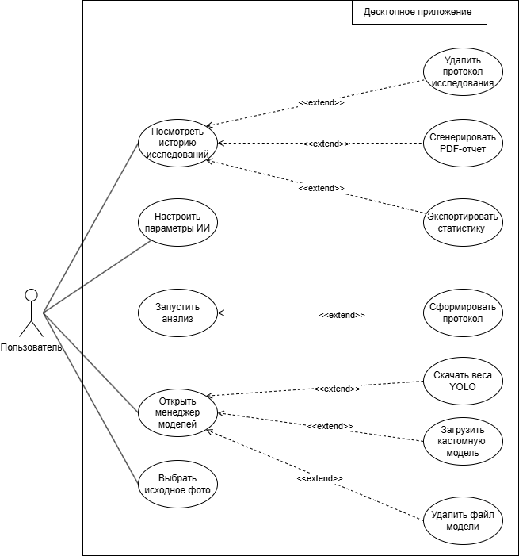
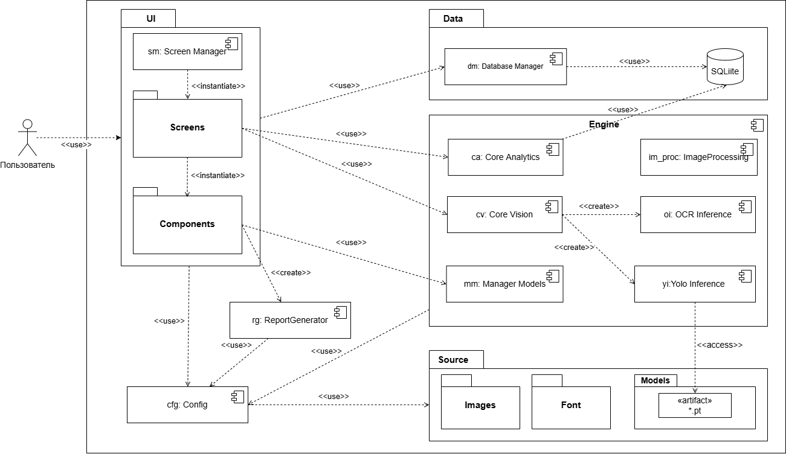

# Описание диаграммы Вариантов использования

В разрабатываемой системе выделяется один основной актер – Пользователь, выступающий в роли оператора программного комплекса. Он взаимодействует с локальной графической оболочкой, при этом ему доступен полный набор функций десктопного приложения без разграничения прав доступа. Оператор может гибко управлять параметра-ми искусственного интеллекта, выбирая активную ИИ-модель из локального каталога, настраивая порог точности распознавания и активируя режим распознавания текста. Перед запуском комплексного анализа система позволяет выбрать медиафайл на диске и выполняет его автоматическое кэширование. Наличие интерактивных элементов интерфейса позволяет оператору адаптировать чувствительность нейросети под специфику конкретного входного растра, сглаживая дефекты освещения или шумы исходного кадра.

В части работы с результатами распознавания оператор осу-ществляет визуальную верификацию найденных объектов, настраивает состав отображаемых элементов и подтверждает формирование локаль-ного протокола исследования. В этот момент приложение автоматически нарезает графические фрагменты (кропы) обнаруженных объектов для формирования датасета. Полученная разметка служит основой для по-следующего дообучения моделей на специфических выборках непосред-ственно внутри программы.

Помимо аналитического модуля, пользователю доступен встроен-ный менеджер моделей. Он предназначен для асинхронного скачивания весов YOLO с удаленного репозитория Hugging Face в фоновом потоке, скачивания кастомных файлов конфигураций и удаления неиспользуе-мых моделей с диска для экономии места. Для управления накопленной информацией предусмотрен архив исследований с функцией «живой» фильтрации записей в базе данных SQLite непосредственно при вводе текста. Из этого интерфейса пользователь может безвозвратно удалять старые протоколы, а также запускать потоковую генерацию многостра-ничных PDF-отчетов и экспорт сводной статистики в формат Excel. Ав-томатизированная выгрузка отчетных документов позволяет бесшовно интегрировать результаты ИИ-анализа в существующие бизнес-процессы предприятия.

# Описание диаграммы Компонентов 

## 📌 Архитектурные особенности реализации

Диаграмма спроектирована строго по стандартам UML 2.0 с учетом специфики модульной архитектуры на языке Python:

1. **Изоляция слоя ресурсов (пакет `Source`)**:
   Папка ресурсов вынесена на корневой уровень проекта внутри пакета `App`. Это гарантирует независимость статических данных приложения от логики интерфейса (`UI`) и вычислительного ядра (`Engine`), обеспечивая стабильную сборку и деплой проекта.
   
2. **Динамический пул моделей (`*.pt`)**:
   Внутри подпакета `Source::Models` расположен динамический артефакт `*.pt`. Он обозначает неограниченное множество весов нейросети YOLO. Компонент инференса обращается к этой директории для динамической загрузки доступных моделей. Кратность `*` указывает на то, что система способна подхватывать и инициализировать любое количество конфигураций весов без изменения исходного кода.

3. **Внутренняя структура компонента `Engine`**:
   Вычислительное ядро `Engine` декомпозировано на внутренние части (Parts).
4. **Паттерн инициализации интерфейса**:
   Связь между пакетами внутри слоя `UI` использует стереотип `«instantiate»`. Компонент управления экранами (`Screen Manager`) динамически порождает и управляет жизненным циклом графических окон (`Screens`), которые, в свою очередь, управляют элементами слоя `Components`.

---

## 📂 Спецификация элементов диаграммы

### Логические пакеты и компоненты (Packages and Components)
*   **`UI`**: Слой графического интерфейса пользователя (на базе PyQt6). Содержит логику отображения, кастомные виджеты и менеджер экранов.
*   **`CFG (Config)`**: Модуль глобальной конфигурации системы. Управляет путями к директориям и инициализацией рабочих папок.
*   **`Data`**: Слой persistence-логики. Включает в себя `Database Manager` и локальное файловое хранилище на базе реляционной СУБД `SQLite`.
*   **`ReportGenerator`**: Автономный подмодуль для сборки и выгрузки результатов анализа в отчетные форматы.
*   **`Source`**: Контейнер статических ассетов (шрифты `Font`, изображения `Images` и веса нейросетей `Models`).

### Ключевые стереотипы связей (Dependencies)

#### Объяснение связей в пакете пользовательского интерфейса и ядра

*   **`«instantiate»`**: Отражает процесс динамического создания экземпляров классов одного программного пакета силами другого.
    *   *Техническая реализация:* Компонент `Screen Manager` динамически порождает объекты окон и экранов. В коде это реализовано в файле `[main_window.py]` на строках `[207-220]`, где метод `[def setup_screens]()` инициализирует экземпляры классов экранов `[MainScreen, IdentifierScreen, HistoryScreen, AnalyticsScreen]`.
    *   *Связь с компонентами:* Аналогично, внутри пакета `Screens` , где экраны `[IdentifierScreen, HistoryScreen]`в файлах `[history_screen.py]` на строке `[265]` и `[inentifier_screen.py]` на строках `[328,404]`происходит создание кастомных виджетов из пакета `Components` с помощью вызовов `def open_protocol_details(); def open_model_installer(); def open_object_editor()`.

*   **`«use»`**: Обозначает чтение конфигурационных констант, утилит или обращение к интерфейсам баз данных.
    *   *Чтение конфигурации:* `85%` компонентов используют модуль конфигурации, это было реализовано для удобной работы с путями директорий. Использование путей объявляется в начале кода, со всеми импортами библиотек. В свою очередь файл конфигурации `config.py` использует пакет `Source`, который как было сказано ранее является контейнером статических ассетов.
    *   *Связи интерфейса (UI) к движку (Engine):* Пакет `Screens` использует функционал модулей `Core Analytics` и `Core Vision` для запуска алгоритмов анализа. Точки вызова методов обработки изображений и расчета метрик зафиксированы в файлах окон `identifier_screen.py` и `analytics_screen.py`. Компоненты UI (`Components`), в свою очередь, взаимодействуют с `Manager Models` для отправки команд на установку/удаление весов нейросетей.
    *   *Использование Database Manager в UI:* Пакеты `Screens` и `Components` использует `Database Manager` для базовых операций, унаследованных от логики инициализации в `Screen Manager` файле `main_window.py`. Вызовы методов выполнения транзакций прописаны в файлах окон `analytics_screen.py` на строке `[213]`; `history_screen.py` на строках `[232,257,277]` и виджетов файлов `object_editor.py` на строках `[102,229]` и `protocol_dialog.py` на строке `[231,229]`.
    *   *Прямая работа с БД (Core Analytics):* Взаимодействие внутренней части `Core Analytics` с репозиторием `SQLite` осуществляется **напрямую**. В коде это соответствует строкам `[12]` в файле `[analytics_engine.py]`, где модуль аналитики берет данные через метод `def get_data()` и использует для построения графиков и общего экспорта сводных результатов.

*   **`«create»`**: Означает, что целевой элемент создается или генерируется исходным компонентом «на лету» в процессе выполнения программы.
    *   *Генерация отчетов:* В пакете графических компонентов (`Components`) файл `[protocol_dialog.py]` инициирует экспорт данных, заставляя `ReportGenerator` физически собрать документ на диске на строке `[17]`. После по нажатию кнопки вызывается функция `def export_pdf()`, создающая финальный PDF/XLSX файл отчета.
    *   *Инициализация подмодулей ИИ:* Внутри вычислительного движка оркестратор `Core Vision` создает рабочие сессии для тяжелых подсистем. Так, на строке `[9]` файла `[vision_engine.py]` метод инициализации создает (`«create»`) экземпляры классы инференсов `OCR` и `Yolo`, которые задействует методе `def analyze()` на строке `22`.

*   **`«access»`**: Применяется для явного считывания кодом инференса физических файлов моделей ИИ с диска.
    *   *Загрузка весов YOLO:* Компонент `Yolo Inference` сканирует папку `Source/Models` для инициализации весов нейросети. Физический доступ к динамическому пулу файлов `*.pt` прописан в файле `[object_detector.py]` на строке `[18]`, где функция загрузки  `def _load_yolo_weights()` принимает вычисленный путь к файлу весов и после с помощью функции установки `def set_model()`загружает его в память GPU/CPU.

---

# Описание диаграммы Деятельности

# Описание диаграммы Последовательности
